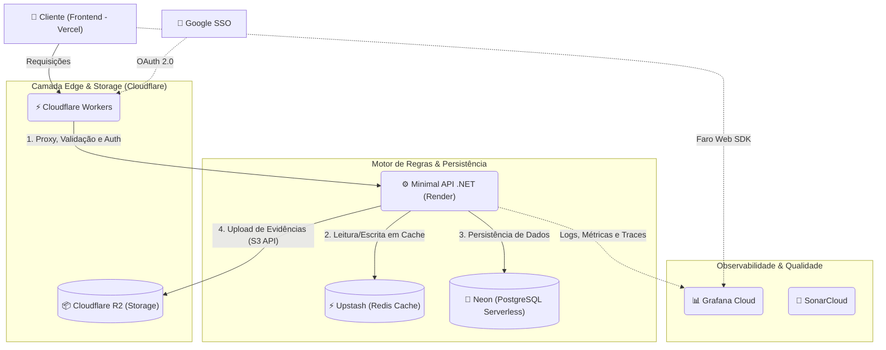

# 🐀 EleveRats 2026

> **Empowering communities through fitness, gamification, and faith.**

[](https://sonarcloud.io/summary/new_code?id=gabs-passarinho-garcia_EleveRats)
[](https://www.postgresql.org/)
[](https://neon.tech/)
[](https://bun.sh/)
[](https://www.gnu.org/licenses/agpl-3.0)
[](https://github.com/gabs-passarinho-garcia/EleveRats/actions/workflows/ci.yml)
[](https://github.com/gabs-passarinho-garcia/EleveRats/actions/workflows/infra-deploy.yml)

O **EleveRats 2026** é o motor de automação e validação de check-ins para o desafio oficial de constância e desenvolvimento do **Ministério Eleve**.

Inspirado em sistemas de progressão de RPG, o projeto visa gamificar o fortalecimento do caráter através de três pilares: **Disciplina no Corpo**, **Disciplina no Espírito** e **Engajamento na Casa**. Construído com um backend de alta performance em **.NET 10** e um frontend ultrarrápido com **Vite + Bun**, este repositório é um verdadeiro caso de estudo de **Clean Architecture**, **Domain-Driven Design (DDD)** e **DevOps** moderno operando com tipagem forte de ponta a ponta.

---

## 🌟 Por que o EleveRats?

Eventos comunitários têm um perfil de tráfego único: **picos extremos e repentinos** (a famosa hora do check-in da galera). O EleveRats foi desenhado do zero para resolver esse problema de coordenação de forma resiliente e escalável:

- **Check-ins Gamificados:** Engajando os participantes a manterem a constância nos três pilares com validação rigorosa de evidências.
- **Backend de Alta Performance:** Tipagem forte com **.NET 10**, Entity Framework Core e cache em milissegundos.
- **Frontend na Borda (Edge):** Componentes funcionais, rápidos e entregues via Vercel.
- **Software Livre:** Licenciado sob **AGPLv3**, garantindo que a plataforma permaneça aberta e útil para qualquer comunidade.

---

## 🏗️ Arquitetura (A Nuvem Distribuída)

O sistema opera em uma arquitetura moderna, 100% gerenciada e Serverless/Edge. Desenhada para ser de baixo custo e com escalabilidade instantânea, a aplicação divide responsabilidades de forma clara entre a borda e a retaguarda.



### 🛠️ Tech Stack & Responsabilidades

- **🌐 Frontend & Borda (Edge)**
  - **Runtime & Build:** [Bun](https://bun.sh/) + [Vite](https://vitejs.dev/) hospedados na **Vercel** com TypeScript estrito.
  - **Gateway & Interceptação:** **Cloudflare Workers** atua como escudo e roteador na borda, validando payloads e auth primária antes de onerar o backend.
- **🧠 Cérebro e Processamento**
  - **Lógica de Negócio:** Minimal API em **.NET 10 (C#)** hospedada no **Render**. Responsável por todo o motor de regras e emissão de pontuações.
- **💾 Persistência e Estado**
  - **Banco de Dados:** **Neon (PostgreSQL Serverless)**. Separa *compute* de *storage*, escala a zero quando ocioso e aguenta os bursts da comunidade como um profissional.
  - **Cache:** **Upstash (Redis Serverless)** para dados efêmeros e sessões ultrarrápidas.
  - **Armazenamento de Mídia:** **Cloudflare R2** para guardar os comprovantes físicos pesados (fotos de check-ins) compatível com API S3.
- **🛡️ Infraestrutura, Observabilidade e Qualidade**
  - **IaC:** **OpenTofu** (Infrastructure as Code) automatizando Neon, Render, Upstash e R2.
  - **Monitoramento:** LGTM Stack via **Grafana Cloud** (Loki, Tempo, Prometheus), traçando desde o click no frontend Vite até a query no Neon.
  - **Inspeção Contínua:** **SonarCloud** barrando *code smells* antes do merge.

---

## 🚀 Guias e Execução Local

Como a arquitetura é inteiramente baseada em serviços gerenciados na nuvem, o setup local é leve. Não é preciso subir containers de banco de dados pesados na sua máquina, bastando apontar para os serviços de desenvolvimento via `.env`.

👉 **[Guia de Deploy no Neon Serverless](./docs/NEON.md)** 👉 **[Guia de Infraestrutura as Code (OpenTofu)](./docs/INFRA.md)**

### Pré-requisitos

* SDK do **.NET 10.0** (ou superior).
- **Bun** instalado para o ecossistema frontend.
- Acesso aos tokens de desenvolvimento (Neon, Upstash, R2, Grafana).

### Passo a Passo

1. **Clone o repositório e configure as variáveis:**

   ```bash
   git clone [https://github.com/seu-usuario/eleverats.git](https://github.com/seu-usuario/eleverats.git)
   cd eleverats
   ```

   *Crie os arquivos `.env` nas pastas `backend` e `frontend` baseados nos respectivos arquivos `.env.example`.*

2. **Inicie o Backend (.NET):**

   ```bash
   cd backend
   dotnet restore
   dotnet run
   ```

3. **Inicie o Frontend (Vite + Bun):**
   Em um novo terminal:

   ```bash
   cd frontend
   bun install
   bun run dev
   ```

   *(Nota: Para simular o comportamento do Cloudflare Workers localmente, consulte a documentação da ferramenta `Wrangler`).*

---

## 🤝 Contribuindo

Este é um projeto de **Software Livre**. Seja você um entusiasta de C#/.NET focado em arquitetura limpa, um desenvolvedor TypeScript apaixonado pela velocidade do Bun, ou um mago do DevOps refinando nosso OpenTofu, suas contribuições são muito bem-vindas.

---

## 📜 Licença

Distribuído sob a **GNU Affero General Public License v3.0 (AGPLv3)**. Consulte o arquivo `LICENSE` para mais informações. O uso de software livre é um pilar no desenvolvimento deste ecossistema.
