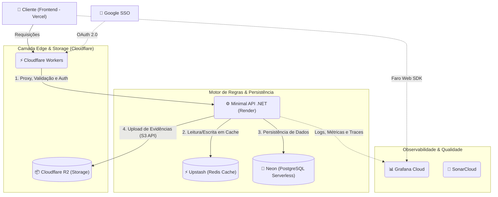

# 🐀 EleveRats 2026 - Sistema de Validação Automática

[](https://sonarcloud.io/summary/new_code?id=gabs-passarinho-garcia_EleveRats)

O **EleveRats 2026** é o motor de automação e validação de check-ins para o desafio oficial de constância e desenvolvimento do Ministério Eleve.

Inspirado em sistemas de progressão de RPG, o projeto visa gamificar o fortalecimento do caráter através de três pilares: **Disciplina no Corpo**, **Disciplina no Espírito** e **Engajamento na Casa**. Este repositório contém a infraestrutura e a lógica full-stack para validar as evidências submetidas pelos participantes, operando com tipagem forte e alta performance.

## 🏗️ Arquitetura (A Nuvem Distribuída)

O sistema evoluiu para uma arquitetura moderna, 100% gerenciada e Serverless/Edge. Desenhada para ser resiliente, de baixo custo e com escalabilidade instantânea, a aplicação divide responsabilidades de forma clara entre a borda (Edge) e os serviços de retaguarda.



### 🌐 Frontend & Borda (Edge)

* **Frontend:** Hospedado na **Vercel**, construído com **Vite + Bun**. Focado em performance, componentes funcionais e tipagem estrita no TypeScript.
* **Gateway & Interceptação:** **Cloudflare Workers** atua como o escudo e roteador na borda. Valida payloads, verifica autenticação primária e repassa as requisições limpas para o backend, reduzindo o processamento do servidor principal.

### 🧠 Cérebro e Processamento

* **Lógica de Negócio:** Minimal API em **.NET (C#)** hospedada no **Render**. Processa regras de negócio, aplica validações rigorosas dos pilares do desafio e gerencia a emissão de pontuações de forma totalmente *type-safe*.

### 💾 Persistência e Estado

* **Armazenamento de Mídia:** **Cloudflare R2** - Object Storage compatível com a API S3, utilizado para guardar os comprovantes físicos pesados (fotos de check-ins).
* **Banco de Dados:** **Neon** (PostgreSQL Serverless) - Separa *compute* de *storage*, garantindo escalabilidade e conexões rápidas para registrar pontuações e usuários.
* **Cache:** **Upstash** (Redis Serverless) - Mantém dados efêmeros e tokens de sessão disponíveis em milissegundos para o backend.

### 🛡️ Qualidade e Observabilidade

* **Monitoramento:** **Grafana Cloud** - Centraliza logs, traces e métricas tanto do backend (.NET) quanto do frontend.
* **Inspeção Contínua:** **SonarCloud** - Garante que o código mantenha os padrões de qualidade e segurança antes de qualquer *merge*.

## 🚀 Como Executar Localmente

Como a arquitetura é baseada em serviços gerenciados na nuvem, o setup local é leve e não exige subir bancos de dados pesados na sua máquina, bastando apontar para os serviços via `.env`.

### Pré-requisitos

* SDK do [.NET 8.0+](https://dotnet.microsoft.com/download) (ou superior).
* [Bun](https://bun.sh/) instalado para o frontend.
* Acesso aos tokens de desenvolvimento (Neon, Upstash, R2, Grafana).

### Passo a Passo

1. **Clone o repositório e configure as variáveis:**

   ```bash
   git clone [https://github.com/seu-usuario/eleverats.git](https://github.com/seu-usuario/eleverats.git)
   cd eleverats
   ```

   Crie os arquivos `.env` nas pastas `backend` e `frontend` baseados nos respectivos arquivos `.env.example`.

2. **Inicie o Backend (.NET):**

   ```bash
   cd backend
   dotnet restore
   dotnet run
   ```

3. **Inicie o Frontend (Vite + Bun):**
   Em um novo terminal:

   ```bash
   cd frontend
   bun install
   bun run dev
   ```

*(Nota: Para simular o comportamento do Cloudflare Workers localmente, consulte a documentação da ferramenta `Wrangler` inclusa nas dependências de desenvolvimento).*

## 📜 Licença

Este projeto está licenciado sob a **GNU General Public License v3.0** (GPL-3.0). Consulte o arquivo `LICENSE` para mais detalhes. O uso de software livre é um pilar no desenvolvimento deste ecossistema.
