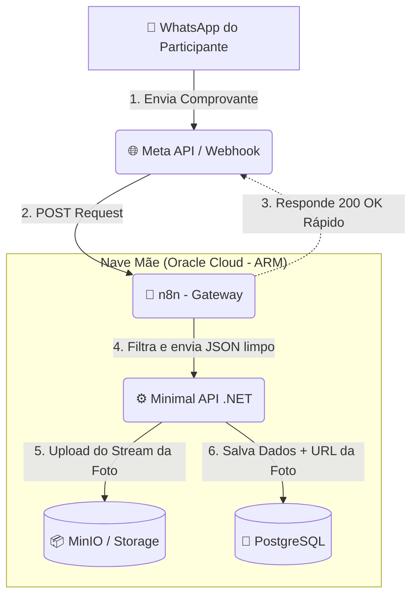

# 🐀 EleveRats 2026 - Sistema de Validação Automática

O **EleveRats 2026** é o motor de automação e validação de check-ins para o desafio oficial de constância e desenvolvimento do Ministério Eleve. 

Inspirado em sistemas de progressão de RPG, o projeto visa gamificar o fortalecimento do caráter através de três pilares: **Disciplina no Corpo**, **Disciplina no Espírito** e **Engajamento na Casa**. Este repositório contém a infraestrutura e a lógica de backend para validar as evidências (fotos de treinos, Strava, cronômetros) enviadas pelos participantes via WhatsApp.

## 🏗️ Arquitetura (A Nave Mãe)

O sistema foi desenhado para ser resiliente, de baixo custo e com zero "cold starts", rodando de forma unificada em uma instância ARM (Oracle Cloud).



* **Gateway & Triagem:** [n8n](https://n8n.io/) - Atua como "para-choque" recebendo os webhooks da Meta. Responde instantaneamente para evitar retentativas e faz a primeira validação baseada em templates de texto.
* **Cérebro (Lógica de Negócio):** Minimal API em **.NET (C#)** - Processa o JSON limpo do n8n, faz o download da imagem em RAM e aplica as regras rigorosas do desafio.
* **Armazenamento de Mídia:** Object Storage (MinIO) - Guarda os comprovantes físicos pesados, mantendo o banco relacional leve.
* **Banco de Dados:** PostgreSQL - Registra pontuações, usuários, pilares alcançados e URLs públicas das imagens.
* **Orquestração e Rede:** Docker Compose com rede em *Bridge* isolada e Caddy/Nginx como Reverse Proxy (SSL automático).

## ⚙️ Fluxo de Dados (Fase 1)

1. O participante envia a foto do comprovante de treino + texto no padrão via WhatsApp.
2. O webhook da Meta aciona o contêiner do **n8n**.
3. O n8n filtra mensagens fora do padrão e empacota os dados válidos.
4. A API em **.NET** recebe o payload, baixa a foto e faz o upload direto para o Storage.
5. O registro de *check-in* (ID, data, tempo, URL da imagem) é consolidado no **PostgreSQL** para contabilização de pontos e geração de ranking.

*(Nota: O roadmap inclui a implementação de LLMs multimodais para leitura automatizada dos dados das imagens, eliminando a validação humana das evidências).*

## 🚀 Como Executar Localmente

### Pré-requisitos
* [Docker](https://www.docker.com/) e Docker Compose instalados.
* SDK do [.NET 8.0+](https://dotnet.microsoft.com/download) (ou superior).

### Passo a Passo

1. Clone o repositório:
   ```bash
   git clone [https://github.com/seu-usuario/eleverats.git](https://github.com/seu-usuario/eleverats.git)
   cd eleverats
   ```

2. Configure as variáveis de ambiente:
   Crie um arquivo `.env` na raiz do projeto baseado no `.env.example` para configurar as credenciais do Postgres, Meta API e Storage.

3. Suba a infraestrutura (Postgres, n8n, MinIO):
   ```bash
   docker-compose up -d
   ```

4. Execute a Minimal API (.NET):
   ```bash
   dotnet run --project src/EleveRats.Api
   ```

## 📜 Licença

Este projeto está licenciado sob a **GNU General Public License v3.0** (GPL-3.0). Consulte o arquivo `LICENSE` para mais detalhes. O uso de software livre é um pilar no desenvolvimento deste ecossistema.
