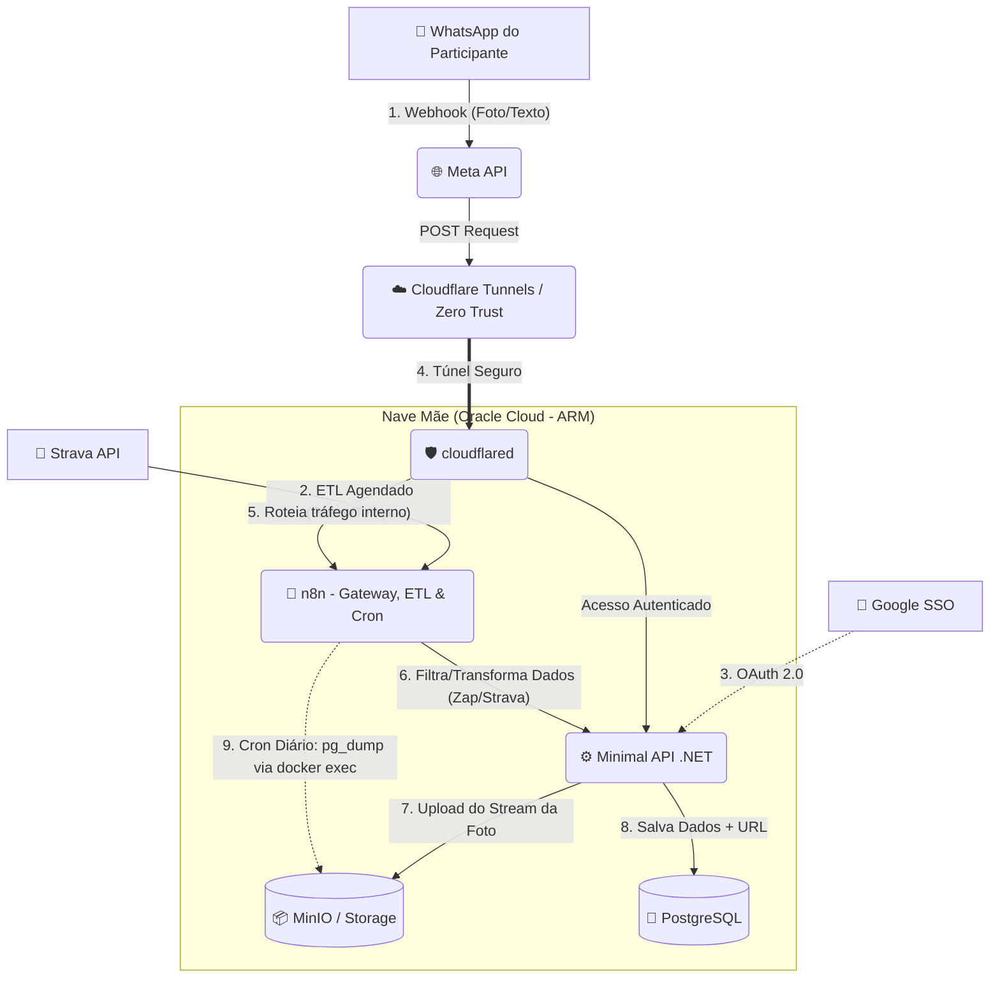

# 🐀 EleveRats 2026 - Sistema de Validação Automática

[](https://sonarcloud.io/summary/new_code?id=gabs-passarinho-garcia_EleveRats)

O **EleveRats 2026** é o motor de automação e validação de check-ins para o desafio oficial de constância e desenvolvimento do Ministério Eleve.

Inspirado em sistemas de progressão de RPG, o projeto visa gamificar o fortalecimento do caráter através de três pilares: **Disciplina no Corpo**, **Disciplina no Espírito** e **Engajamento na Casa**. Este repositório contém a infraestrutura e a lógica de backend para validar as evidências (fotos de treinos, dados do Strava, cronômetros) submetidas pelos participantes.

## 🏗️ Arquitetura (A Nave Mãe)

O sistema foi desenhado para ser resiliente, de baixo custo e com zero "cold starts", rodando de forma unificada e blindada em uma instância ARM (Oracle Cloud). Nenhuma porta de entrada (inbound) é exposta para a internet.



### 🛡️ Segurança e Autenticação

* **Borda (Zero Trust):** [Cloudflare Tunnels](https://developers.cloudflare.com/cloudflare-one/connections/connect-networks/) (`cloudflared`) - Conecta a infraestrutura interna à rede da Cloudflare, eliminando IPs públicos e portas abertas.
* **Identidade:** Autenticação unificada utilizando **Google SSO (OAuth 2.0)** integrada nativamente na Minimal API (e via Cloudflare Access para os painéis administrativos), livrando a aplicação do gerenciamento braçal de tokens e garantindo segurança robusta sem custos adicionais.

### 🧠 Cérebro e Processamento

* **Gateway & ETL:** [n8n](https://n8n.io/) - O verdadeiro trator da operação. Atua em três frentes:
  1. **Webhook:** Recebe as mensagens da Meta API e responde rápido para evitar retentativas.
  2. **ETL do Strava:** Roda rotinas agendadas (CRON) para bater na API do Strava, extrair dados de treinos dos usuários vinculados e limpar os dados.
  3. **Auto-Cuidado:** Executa rotinas de backup diário (`pg_dump` via `docker exec`) e envia os artefatos de segurança para o Storage.
* **Lógica de Negócio:** Minimal API em **.NET (C#)** - Processa os JSONs limpos do n8n, baixa as imagens em RAM, interage com o Google SSO e aplica as regras rigorosas do desafio.

### 💾 Persistência

* **Armazenamento de Mídia:** Object Storage (MinIO) - Guarda os comprovantes físicos pesados (fotos) e os arquivos de backup do banco de dados, mantendo o PostgreSQL leve.
* **Banco de Dados:** PostgreSQL - Registra pontuações, usuários autenticados, pilares alcançados e URLs públicas das evidências.

## ⚙️ Fluxo de Dados (Fase 1)

1. **Via WhatsApp:** O participante envia a foto + texto no padrão. A Meta API aciona o túnel até o n8n.
2. **Via Strava:** O n8n executa a rotina diária de ETL, extraindo automaticamente os treinos registrados.
3. O n8n unifica os formatos e entrega um Payload limpo para a Minimal API (.NET).
4. A API processa a evidência, guarda a mídia no MinIO e computa os pontos no PostgreSQL.
5. Durante a madrugada, o n8n executa um comando de dump do banco e salva o *snapshot* no MinIO.

*(Nota: O roadmap inclui a implementação de LLMs multimodais para leitura automatizada das imagens que não vierem do Strava, eliminando de vez a validação humana das evidências).*

## 🚀 Como Executar Localmente

### Pré-requisitos

* [Docker](https://www.docker.com/) e Docker Compose instalados.
* SDK do [.NET 8.0+](https://dotnet.microsoft.com/download) (ou superior).
* Token do Cloudflare Zero Trust e credenciais OAuth do Google.

### Passo a Passo

1. Clone o repositório:

   ```bash
   git clone [https://github.com/seu-usuario/eleverats.git](https://github.com/seu-usuario/eleverats.git)
   cd eleverats
   ```

2. Configure as variáveis de ambiente:

   Crie um arquivo `.env` na raiz do projeto baseado no `.env.example` para configurar as credenciais.

3. Suba a infraestrutura:

   ```bash
   docker-compose up -d
   ```

4. Execute a Minimal API (.NET):

   ```bash
   dotnet run --project src/EleveRats.Api
   ```

## 📜 Licença

Este projeto está licenciado sob a **GNU General Public License v3.0** (GPL-3.0). Consulte o arquivo `LICENSE` para mais detalhes. O uso de software livre é um pilar no desenvolvimento deste ecossistema.
